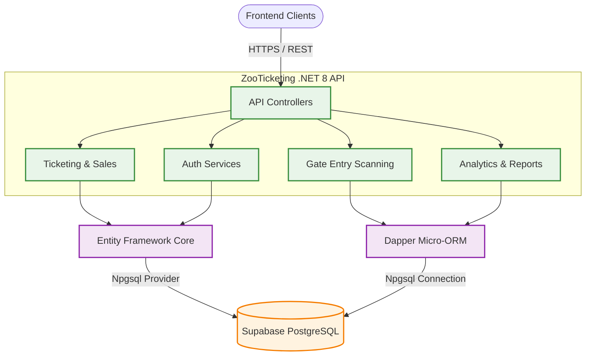

<div align="center">

# 🦁 ZooTicketing API

**A high-performance, massively scalable backend for modern e-ticketing and zoological park management.**

<p align="center">
  <a href="#tech-stack">
    
  </a>
  <a href="#tech-stack">
    
  </a>
  <a href="#tech-stack">
    
  </a>
  <a href="#tech-stack">
    
  </a>
  <a href="#tech-stack">
    
  </a>
</p>

[](https://opensource.org/licenses/MIT)

</div>

---

## ✨ Features

- **🛡️ Secure JWT Authentication:** Robust stateless authentication and role-based access for Admins, Counters, and Customers.
- **⚡ Blazing Fast Data Access:** Hybrid data access architecture using **Entity Framework Core** for schema management and **Dapper** micro-ORM for lightning-fast queries and analytics.
- **📊 Real-Time Analytics Endpoints:** Optimized data aggregation endpoints to power admin dashboards (revenue, sales, and live gate entries).
- **🎟️ Smart Ticket Processing:** High-concurrency ticket generation, validation, and real-time gate scanning capabilities.
- **☁️ Cloud-Native Database:** Seamlessly integrates with PostgreSQL hosted on **Supabase** via `Npgsql`.
- **📖 Swagger OpenAPI:** Fully documented interactive REST endpoints.

---

## 🏗️ System Architecture

The backend leverages a hybrid ORM approach within a monolithic API structure to guarantee optimal data fetching speeds without sacrificing developer experience.



---

## 🚀 Getting Started

### ☑️ Prerequisites

Before you begin, ensure you have the following installed:
- [x] **.NET 8.0 SDK** (or newer)
- [x] **PostgreSQL** (or a remote Supabase instance)
- [x] **Visual Studio 2022** / **Rider** / **VS Code** with C# Dev Kit

### 💻 Local Development & Installation

Follow these steps to get the API running locally:

```bash
# 1. Clone the repository
git clone https://github.com/zamiljahid/ZooETicketingAPI.git
cd ZooETicketingAPI/ZooTicketing.API

# 2. Restore NuGet dependencies
dotnet restore

# 3. Apply Entity Framework Migrations (if applicable)
dotnet ef database update

# 4. Run the API locally
dotnet run
```

> **Note:** The API will typically start on `http://localhost:5065` or `https://localhost:7065`. You can test endpoints via the Swagger UI available at `/swagger`.

---

## 💻 Usage & Configuration

Configuration is managed natively via `appsettings.json`. Make sure to update the database connection strings and JWT secrets for your environment.

| ⚙️ Configuration Area | 📄 File / Path | 📝 Description |
| :--- | :--- | :--- |
| **Database Connection** | `appsettings.json` | Set the `DefaultConnection` string for your PostgreSQL/Supabase instance. |
| **JWT Secrets** | `appsettings.json` | Configure the JWT `Key`, `Issuer`, `Audience`, and `ExpiryHours`. |
| **Launch Profiles** | `Properties/launchSettings.json` | Adjust development ports and local HTTPS settings. |
| **CORS Policy** | `Program.cs` | Modify the `"AllowAll"` CORS policy before deploying to production. |

### 🔧 Example Configuration (`appsettings.json`)

```json
{
  "ConnectionStrings": {
    "DefaultConnection": "Host=aws-1-ap-northeast-2.pooler.supabase.com;Port=5432;Database=postgres;Username=your_user;Password=your_password;SSL Mode=Require;Trust Server Certificate=true"
  },
  "Jwt": {
    "Key": "SuperSecretKey_ChangeThisInProduction!",
    "Issuer": "ZooTicketing.API",
    "Audience": "ZooTicketing.Client",
    "ExpiryHours": "8"
  },
  "AllowedHosts": "*"
}
```

---

## 🛠️ Tech Stack & Tools

### ⚙️ Core Backend
- **C# / .NET 8.0** (Cross-platform, high-performance framework)
- **ASP.NET Core Web API** (RESTful endpoints)

### 🗄️ Database & ORM
- **PostgreSQL** (Relational Database, hosted on Supabase)
- **Npgsql** (High-performance .NET data provider for PostgreSQL)
- **Entity Framework Core 8** (Schema modeling and state tracking)
- **Dapper** (Lightweight, lightning-fast micro-ORM for complex queries)

### 🔒 Security & Documentation
- **JWT (JSON Web Tokens)** (Stateless authorization)
- **Swashbuckle / Swagger** (OpenAPI documentation)

<div align="center">
  <i>Built with ❤️ for modern zoological parks.</i>
</div>
